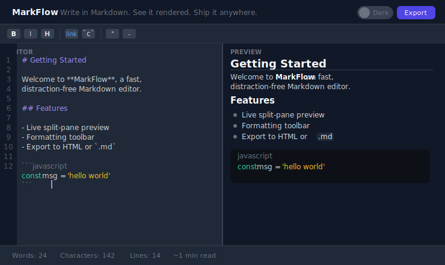

<div align="center">

<br/>

# MarkFlow

**Write Markdown. See it live. Export anywhere.**

A distraction-free editor for developers — split-pane preview, formatting toolbar, dark/light theme, and one-click export to HTML or `.md`. No server. No account. Runs entirely in the browser.

<br/>

[](https://react.dev)
[](https://www.typescriptlang.org)
[](https://tailwindcss.com)
[](https://vitejs.dev)
[](LICENSE)

<br/>



<br/>

```bash
git clone https://github.com/mariotavarez/markdown-editor.git
cd markdown-editor && npm install && npm run dev
```

Open [http://localhost:5173](http://localhost:5173)

<br/>

</div>

---

## Why MarkFlow

Most Markdown editors are either too heavyweight (Notion, Obsidian) or too bare-bones (a textarea and a raw preview). MarkFlow hits the middle — a focused writing experience with just enough tooling to be fast.

Write on the left. See the rendered output on the right. Export when you're done.

---

## Features

**Editor**
- Synchronized line numbers
- Tab key inserts two spaces (no focus trap)
- Cursor-aware formatting — wraps selected text or inserts a placeholder
- `Ctrl+B` bold · `Ctrl+I` italic · `Ctrl+K` link (configurable shortcuts)

**Preview**
- CommonMark-compliant rendering via `marked`
- Scoped prose styles — headings, lists, blockquotes, code blocks, tables
- Scrolls independently from the editor

**Toolbar — 8 actions in 3 groups**

| Group | Buttons |
|---|---|
| Text | Bold · Italic · Heading |
| Links & Code | Link · Inline code · Code block |
| Structure | Blockquote · List item |

**Export & Theme**
- **Export HTML** — downloads a standalone `.html` file with inline styles (opens in any browser)
- **Export Markdown** — downloads the raw `.md` source
- **Copy HTML** — copies the rendered HTML to clipboard
- **Dark / Light toggle** — persisted in `localStorage`; defaults to system preference

**Status bar**
- Live word count, character count, characters (no spaces), line count
- Estimated read time

---

## Quick Start

```bash
git clone https://github.com/mariotavarez/markdown-editor.git
cd markdown-editor
npm install
npm run dev
```

**Production build:**
```bash
npm run build
npm run preview
```

---

## Project Structure

```
src/
├── components/
│   ├── Header.tsx          # Logo, Load example, fullscreen toggle, theme, export menu
│   ├── Toolbar.tsx         # 8 formatting buttons in 3 logical groups
│   ├── ToolbarButton.tsx   # Icon button with hover tooltip and keyboard hint
│   ├── Editor.tsx          # Textarea with line numbers + tab-key handling
│   ├── Preview.tsx         # dangerouslySetInnerHTML with scoped CSS custom props
│   ├── ExportMenu.tsx      # Dropdown: HTML download, MD download, Copy HTML
│   └── StatusBar.tsx       # Live word/char/line count + read time estimate
├── hooks/
│   ├── useEditor.ts        # Editor state, applyAction, keyboard shortcuts
│   ├── useMarkdown.ts      # Memoized marked.parse() rendering
│   ├── useTheme.ts         # Dark/light toggle with localStorage + prefers-color-scheme
│   └── useExport.ts        # downloadFile helper and clipboard copy with feedback
├── utils/
│   ├── insertMarkdown.ts   # Cursor-aware insertion for all 8 toolbar actions
│   └── wordCount.ts        # getTextStats() — words, chars, charsNoSpaces, lines
└── data/sampleContent.ts   # Default document covering all markdown features
```

---

## Keyboard Shortcuts

| Shortcut | Action |
|---|---|
| `Ctrl+B` | Bold selection |
| `Ctrl+I` | Italic selection |
| `Ctrl+K` | Insert link |
| `Tab` | Insert 2 spaces |

---

## Tech Stack

| Technology | Version | Purpose |
|---|---|---|
| React | 19 | UI framework |
| TypeScript | 5.7 | Strict type safety |
| Tailwind CSS | v4 | Vite plugin — zero config |
| marked | 9 | CommonMark Markdown renderer |
| Lucide React | 0.344 | Toolbar icons |
| Vite | 6.2 | Build tool |

---

## License

MIT © [Mario Tavarez](https://github.com/mariotavarez)
